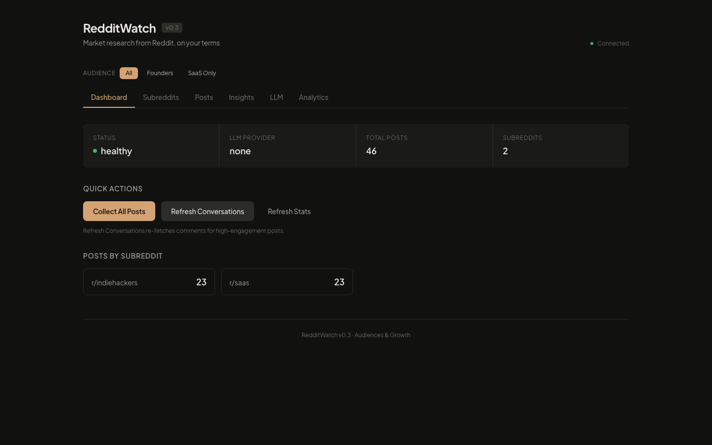
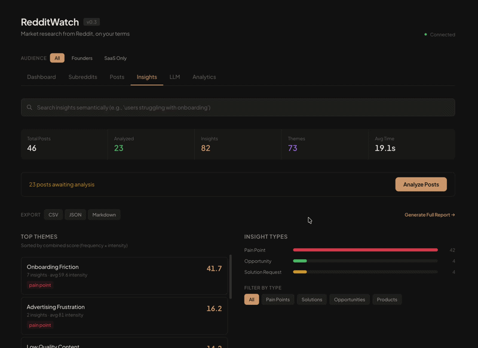
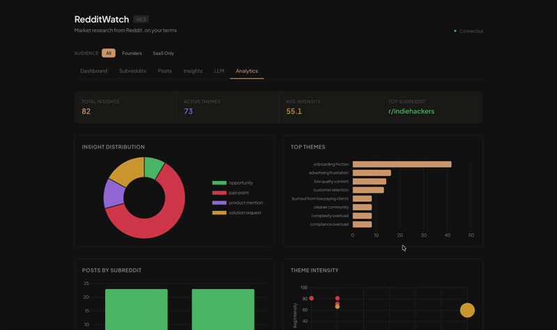
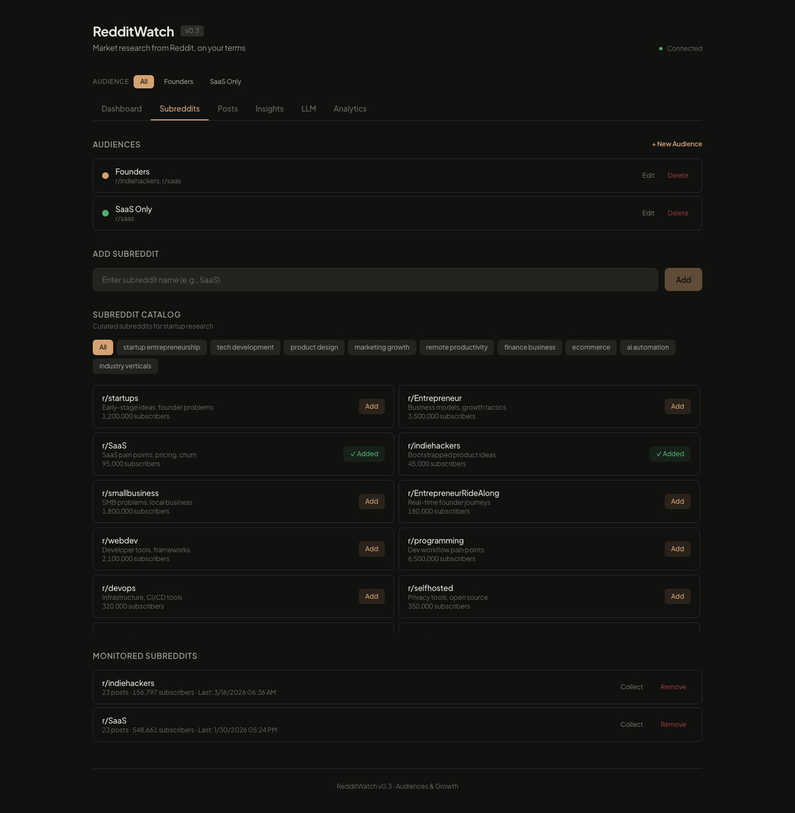
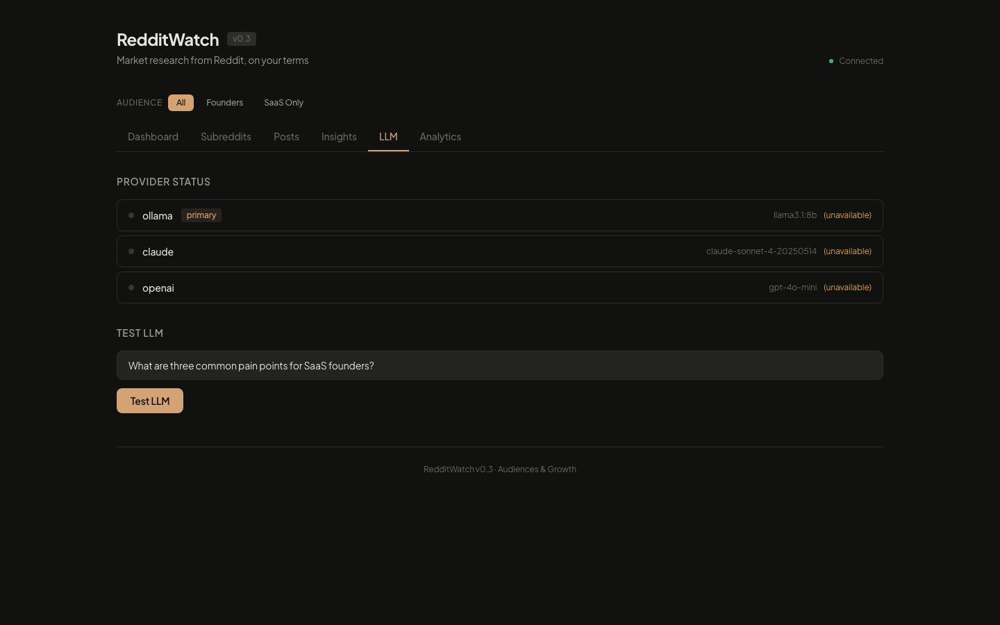

# RedditWatch

[](https://github.com/Aditya1001001/RedditWatch/actions/workflows/test.yml)
[](LICENSE)

**RedditWatch turns noisy Reddit communities into ranked, source-backed market signals.**

A self-hosted community intelligence workspace for PMs, founders, marketers, researchers, and builders who want to understand repeated pain, demand, advice-seeking, workarounds, and product mentions across public Reddit communities. Reddit search helps you find threads. RedditWatch helps you find the patterns hiding across them, with source quotes and Reddit links behind every signal.

RedditWatch uses public Reddit endpoints and local storage, so it does not require Reddit API credentials or a hosted vendor account. Public Reddit surfaces can still change, but the app is designed to be easy to inspect, adapt, and run yourself.



## Project Notes

- [Subreddit data inventory](docs/subreddit-data-inventory.md) — catalog sources, counts, and starter subset
- [Architecture notes](docs/architecture.md) — data flow and subsystem overview

## Why RedditWatch?

- **No Reddit API key required** — Uses public old.reddit.com endpoints and local storage.
- **Free and open source** — Self-host it. No subscriptions, no vendor lock-in.
- **Ranked, source-backed market signals** — Find repeated pain, demand, advice, and product signals from public Reddit communities.
- **Works with free local models** — Defaults to Ollama (llama3.1:8b). Zero cost, fully private. Also supports Claude and OpenAI.
- **Semantic search** — Find related signals by meaning using ChromaDB embeddings.
- **Evidence-first exports** — CSV, JSON, Markdown, or full market signal reports with source quotes and Reddit links.

## See It in Action

### Signals — Themes, Semantic Search, and Exports



### Analytics — Charts, Trends, and Signal Strength



### Subreddit Catalog — 283 Curated Subreddits Across 50 Categories



### LLM Provider Management



## Quick Start

### Option 1: Docker (Recommended)

```bash
git clone https://github.com/Aditya1001001/RedditWatch.git
cd RedditWatch
cp .env.example .env
docker compose up
```

Open http://localhost:8000

RedditWatch defaults to local LLM analysis with Ollama. For Docker, include the Ollama compose file:

```bash
docker compose -f docker-compose.yml -f docker-compose.ollama.yml up
```

The Ollama compose override sets `OLLAMA_BASE_URL=http://ollama:11434` for the app container automatically.

### Option 2: Local Install

```bash
git clone https://github.com/Aditya1001001/RedditWatch.git
cd RedditWatch
./scripts/setup.sh
./scripts/run.sh
```

### Prerequisites (Local)

- Python 3.9+
- [Ollama](https://ollama.ai) with `llama3.1:8b` model, or a Claude/OpenAI API key

```bash
# Install Ollama and pull a model
ollama pull llama3.1:8b
```

## How It Works

### 1. Define An Audience

Create an audience for the market, persona, competitor space, or customer segment you want to research. Add subreddits directly or browse the curated catalog. Follow the audience when you want RedditWatch to include it in scheduled or manual collection.

### 2. Collect Conversations

Click **Collect All**. RedditWatch collects posts and comments from followed audiences using public Reddit endpoints, with local rate limiting and fallbacks for empty or blocked responses.

### 3. Extract Signals

After collection, analysis runs automatically when an LLM provider is available. The LLM reads each post and its comments, then extracts:
- **Pain Signals** — Repeated frustrations with signal strength scores (0-100)
- **Demand Signals** — "I wish there was a tool that..."
- **Product Mentions** — Tools/services discussed, with sentiment
- **Opportunities** — Market gaps and unmet needs

### 4. Review Evidence & Export

- **Themes** — Signals grouped by theme (e.g., "onboarding_friction"), ranked by frequency x signal strength
- **Semantic Search** — Find signals by meaning, not just keywords
- **Ask** — Ask natural-language questions about a selected audience using retrieved signals
- **Evidence** — Review source quotes and open the underlying Reddit discussion
- **Export** — CSV, JSON, Markdown, or generate a source-backed market signal report

## Demo Positioning

Theme: **From Reddit noise to market signals.**

Recommended short demo flow:

1. Open a populated audience.
2. Show signal categories and ranked themes.
3. Filter to **Pain Signals**.
4. Open a quote-backed signal and follow the Reddit source link.
5. Export a market signal report.

Avoid live collection or live LLM analysis during short demos unless the run has been preflighted. A pre-populated local database makes the first “aha” moment faster and more reliable.

## Configuration

RedditWatch works out of the box with Ollama. All settings are optional.

Copy `.env.example` to `.env` for cloud LLM providers:

```bash
# Optional: For Claude API
ANTHROPIC_API_KEY=sk-ant-...

# Optional: For OpenAI API
OPENAI_API_KEY=sk-...
```

Edit `backend/config.yaml` to customize:

```yaml
llm:
  provider: ollama  # or "claude" or "openai"

collection:
  posts_per_subreddit: 25
  include_comments: true

server:
  cors:
    allowed_origins:
      - "http://localhost:8000"
```

RedditWatch is designed for local/self-hosted use and does not include authentication. Do not expose it directly to the public internet without adding access control in front of it.

## API

42+ endpoints across 9 modules. Full interactive docs at http://localhost:8000/docs

| Module | Prefix | Key Endpoints |
|--------|--------|---------------|
| Health | `/api/health` | Health check |
| Posts | `/api/posts` | List, get, delete, stats |
| Subreddits | `/api/subreddits` | CRUD, catalog, collect per-sub |
| Collection | `/api/collect` | Trigger collection, status, refresh comments |
| Analysis | `/api/analyze` | Trigger analysis, themes, signals, status |
| Search | `/api/search` | Semantic search, similar, duplicates |
| Export | `/api/export` | CSV/JSON/Markdown export, reports, quote cards |
| LLM | `/api/llm` | Provider status, test |
| Insights | `/api/insights` | Direct signal queries; route name kept for API compatibility |
| Themes | `/api/themes` | Direct theme queries |

## Architecture

```
Browser (Alpine.js + Tailwind + Chart.js)
  |
FastAPI Backend
  |-- SQLite (posts, comments, signals)
  |-- ChromaDB (vector embeddings)
  |-- LLM Providers
        |-- Ollama (local, default)
        |-- Claude API
        |-- OpenAI API
```

## Tech Stack

- **Backend**: FastAPI, SQLAlchemy (async), SQLite
- **Frontend**: Alpine.js, Tailwind CSS, Chart.js (no build step)
- **LLM**: Ollama (default), Claude, OpenAI
- **Vector Search**: ChromaDB with sentence-transformers
- **Public Reddit Conversations**: HTTP requests to old.reddit.com (no API key needed)
- **Testing**: pytest, pytest-asyncio
- **CI**: GitHub Actions

## Development

```bash
# Run tests
cd backend
python -m pytest tests/ -v

# Run with coverage
python -m pytest tests/ --cov=app --cov-report=term-missing

# Run dev server with hot reload
uvicorn app.main:app --reload --port 8000
```

### Reset Local Runtime Data

To record a fresh first-run demo, archive local runtime state and recreate an empty SQLite schema:

```bash
./scripts/reset-runtime-data.sh
```

This only moves runtime files under `data/`. It does not delete the curated subreddit catalogs in `backend/app/data/`.

To load a deterministic local demo audience without live Reddit collection or live LLM analysis:

```bash
./scripts/load-demo-data.sh
```

This creates a `SaaS Starter` audience with sample posts, comments, quote-backed signals, and a rebuilt local search index. The seeded data is for demos and screen recordings; use live collection when you want fresh public Reddit conversations.

See [CONTRIBUTING.md](CONTRIBUTING.md) for contribution guidelines.

## Roadmap

- [x] Core collection and market signal analysis pipeline
- [x] Semantic search with ChromaDB embeddings
- [x] Export (CSV, JSON, Markdown, full research reports)
- [x] Analytics dashboard with Chart.js visualizations
- [x] Audience grouping and filtering with subreddit suggestions
- [x] 283-subreddit curated catalog across 50 categories
- [x] 6,089-subreddit expanded directory for discovery
- [x] Security hardening, background tasks, testing, Docker
- [x] Scheduled collection (APScheduler)
- [x] Post signal scoring and low-signal skip reasons
- [x] Deterministic sample dataset for offline portfolio demos
- [ ] Full migration framework beyond lightweight SQLite upgrades

## License

[MIT License](LICENSE)

## Acknowledgments

- Inspired by [GummySearch](https://gummysearch.com) and [PainOnSocial](https://painonsocial.com)
- Built with [Ollama](https://ollama.ai), [FastAPI](https://fastapi.tiangolo.com), [ChromaDB](https://www.trychroma.com)

---

If RedditWatch is useful to you, consider giving it a star — it helps others discover the project.
